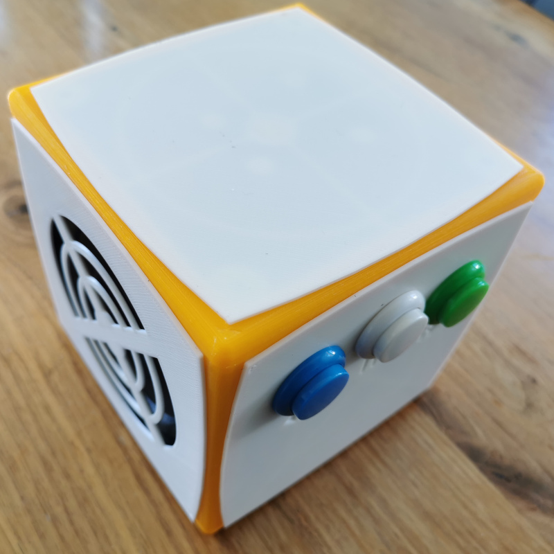
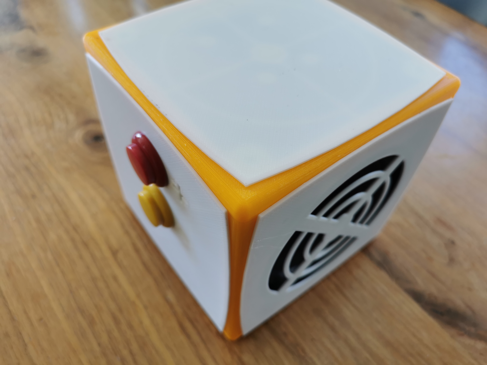
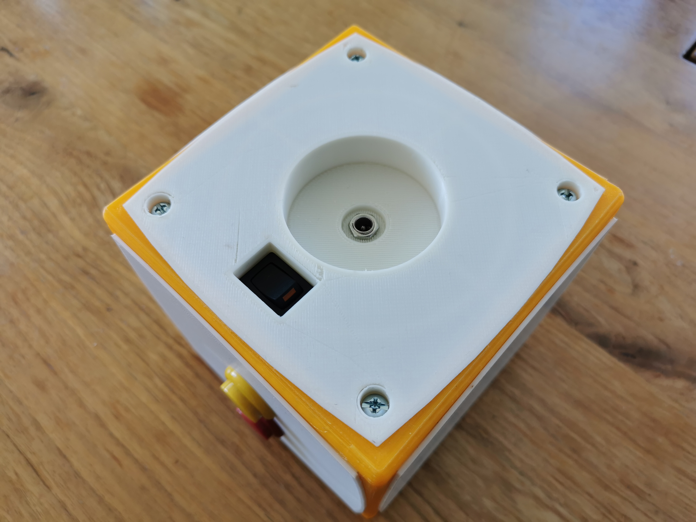
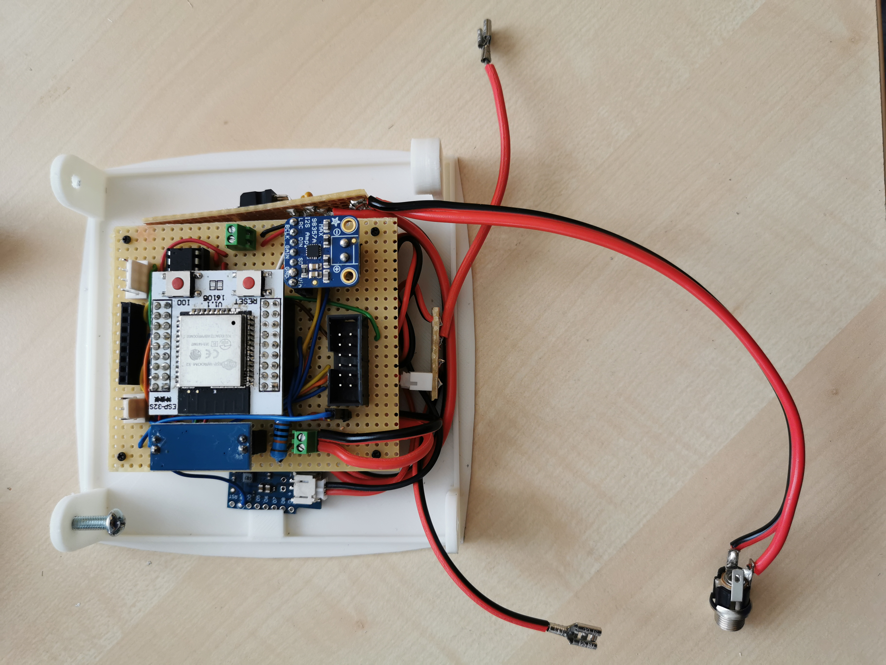
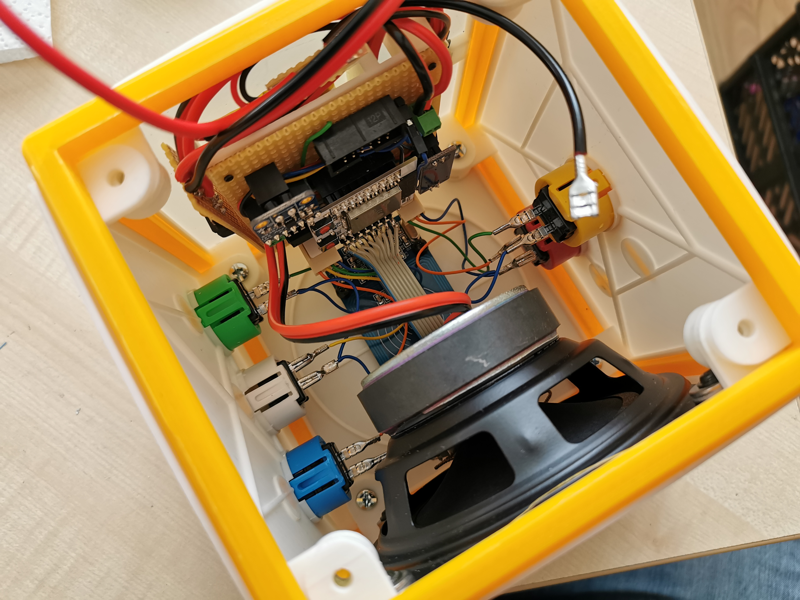

# TonUINO port for ESP32

## Introduction
Kudos to the [TonUINO](https://www.voss.earth/tonuino/) project for more than just a few ideas! I wanted to create my own audio player that responds to the magic of NFC/RFID.

However we're handling a few things differently here:
* We harness the great wireless capabilities of the ESP32 and directly stream via WiFi
* We've dropped DFPlayer so we integrate an I2S breakout
* We're running on battery - and when the battery runs out we still sit nicely on the original charging dock

## Project
The project includes the [source code](https://github.com/BastiG/tonuino-esp32/tree/master/src) for the ESP32 It should build out of the box using VSCode and PlatformIO. Be sure to include the forks of the [rfid](https://github.com/BastiG/rfid) and [ESP8266Audio](https://github.com/BastiG/ESP8266Audio) libraries.

You can also find the electronic components in the [Fritzing file](https://github.com/BastiG/tonuino-esp32/tree/master/fritzing) (no routing done, sorry).

Finally you'll find the 3d printable parts of the box as [OpenSCAD and STL files](https://github.com/BastiG/tonuino-esp32/tree/master/openscad). Note: I used ABS as material for the case faces, the skeleton cube was printed with PLA. I tried the cube in ABS but the warping would always rip at least one edge apart.

### Shopping list
* ESP32 + breakout board (like [this](https://www.amazon.de/dp/B0725YFLTB), don't be afraid of soldering)
* Adafruit I2S Amp with MAX98357A (like [this](https://www.amazon.de/dp/B01K5GCFA6))
* Speaker (like [this](https://www.amazon.de/dp/B003A63NLE))
* MFRC522 reader (like [this](https://www.amazon.de/dp/B01M28JAAZ))
* 1024 kBit  SRAM (like [this](https://www.amazon.de/dp/B0725Z6THD))
* Battery shield (like [this](https://www.amazon.de/dp/B07X93M17P))
* LiPo Battery (like [this](https://www.amazon.de/dp/B07WTWPN6K))
* small parts, buttons, screws, nuts, PCBs, resistors, connectors, wires and even more wires...

## Ideas for future revisions:
* It might have been the better idea to keep the DFPlayer and use the SD card as an offline cache
* There is room for improvement in the power area, improved power management and shutting down components (audio part, WiFi) when they are not in use and wake up from RFID (could the ULP handle SPI communication with the MFRC522?)

## Some pictures

